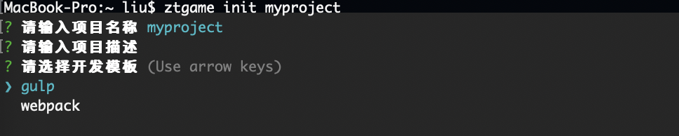

# 安装

webtemplate-gulp 是一个以gulp为基础搭建的前端开发的模版，包含了以下功能：

* css打包
* js打包
* 图片压缩
* 发布代码
* 代理测试服

## 使用方法有两种

### 一、通过ztgame-cli

1、安装ztgame-cli

```bash
npm install ztgame-cli -g
```

2、初始化

```bash
ztgame init myproject
```

3 、选择模版gulp



### 二、从github克隆

1、克隆代码库

```bash
git clone https://github.com/focusbe/webtemplate-gulp.git myproject
```


myproject 替换为项目的目录名


2、修改配置文件 config.json

```javascript
{
    "src": "src/",//源代码目录
    "dist": "dist/",//导出目录
    "game": "",//游戏项目的标识
    "actname": ""//活动目录名称
}
```


